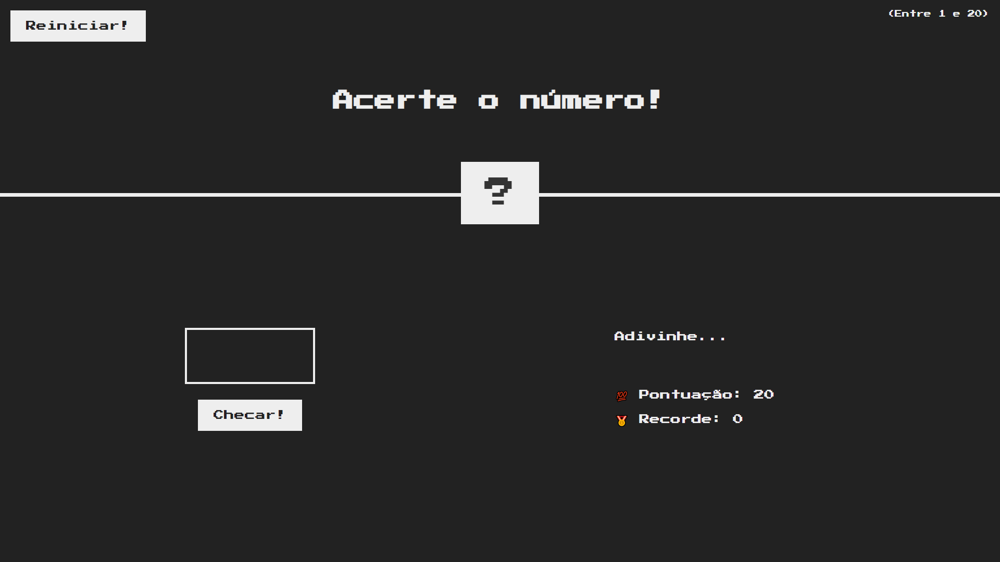
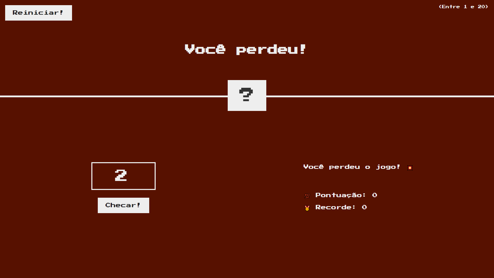
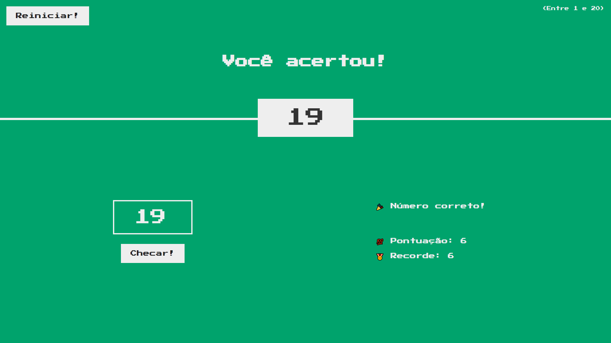

# JS Game: Guess The Number
Um pequeno jogo criado com o intuito de estudar alguns fundamentos da linguagem Javascript, dentre eles, principalmente a manipulação de elementos do DOM.

## Tecnologias utilizadas

  
  
  

## Como jogar?
Primeiramente, basta abrir o arquivo `index.html` em qualquer navegador web.

1. Será gerado um número aleatório entre 1 e 20 e você deve tentar adivinhar!
2. Você começa com 20 pontos, cada vez que você erra o número você perde 2 pontos, se você chegar a zero pontos, você perde!
3. Mas se conseguir adivinhar o número, seus pontos serão adicionados ao recorde e você vence!

## Screenshots

